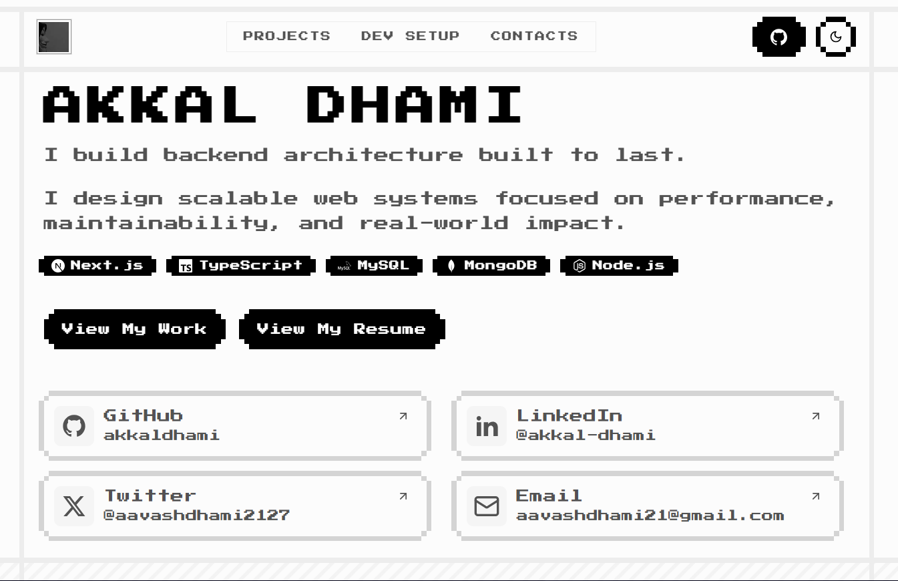

# 8-Bit Portfolio Template

Welcome to the 8-Bit Portfolio Template, a unique and retro-inspired portfolio website designed for developers who want to showcase their work with a nostalgic touch. Built with modern technologies like Next.js and Tailwind CSS, this template combines a classic 8-bit aesthetic with a fast, responsive, and fully customizable experience.



## Links

[Live Link](https://8bit-portfolio-template.vercel.app/)
[Github Link](https://github.com/akkaldhami/8bit-portfolio-template)

## Features

- **Retro 8-Bit Design**: A unique, pixelated design that stands out.
- **Fully Responsive**: Looks great on all devices, from desktops to mobile phones.
- **Easy to Customize**: Built with clean, well-organized code that is easy to modify and extend.
- **Project Showcase**: A dedicated section to display your projects with images, descriptions, and links.
- **Contact Form**: A functional contact form to allow visitors to get in touch with you.
- **SEO Optimized**: Built with best practices for search engine optimization to help you get discovered.

## Getting Started

To get a local copy up and running, follow these simple steps.

### Prerequisites

Make sure you have Node.js and npm installed on your machine.

- [Node.js](https://nodejs.org/) (v20 or higher recommended)
- [npm](https://www.npmjs.com/)

### Installation

1. **Clone the repository**:

   ```bash
   git clone https://github.com/your-username/8bit-portfolio.git
   ```

2. **Navigate to the project directory**:

   ```bash
   cd 8bit-portfolio
   ```

3. **Install dependencies**:

   ```bash
   npm install
   ```

### Running the Development Server

To start the development server, run the following command:

```bash
npm run dev
```

Open [http://localhost:3000](http://localhost:3000) with your browser to see the result.

## Technologies Used

This project is built with the following technologies:

- [Next.js](https://nextjs.org/) - A React framework for building server-side rendered and static websites.
- [React](https://reactjs.org/) - A JavaScript library for building user interfaces.
- [Tailwind CSS](https://tailwindcss.com/) - A utility-first CSS framework for rapid UI development.
- [Shadcn UI](https://ui.shadcn.com) - A set of beautifully designed components that you can copy and paste into your apps.
- [8bitcn](https://www.8bitcn.com) - A set of 8-bit styled components and a code distribution platform.
- [TypeScript](https://www.typescriptlang.org/) - A typed superset of JavaScript that compiles to plain JavaScript.
- [Motion](https://www.motion.dev/) - A library for creating animations in React.
- [Resend](https://resend.com/) - A service for sending transactional emails.
